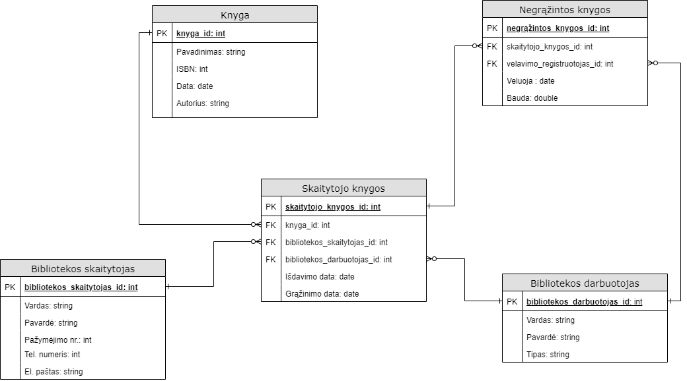

# library-database

## Esybės (Entities):
* Bibliotekos darbuotojai
* Bibliotekos skaitytojai
* Knygos (pavadinimas, ISBN)
## Joje turi būti fiksuojama tokia informacija:
* Skaitytojams išduotos knygos (knyga, koks skaitytojas, kas išdavė)
* Knygų išdavimo/grąžinimo istorija (kada išduota/grąžinta)
* Laiku negrąžintų knygų istorija (kiek laiko vėluojama grąžinti, kokia bauda, kas užregistravo vėlavimą ir kada)

